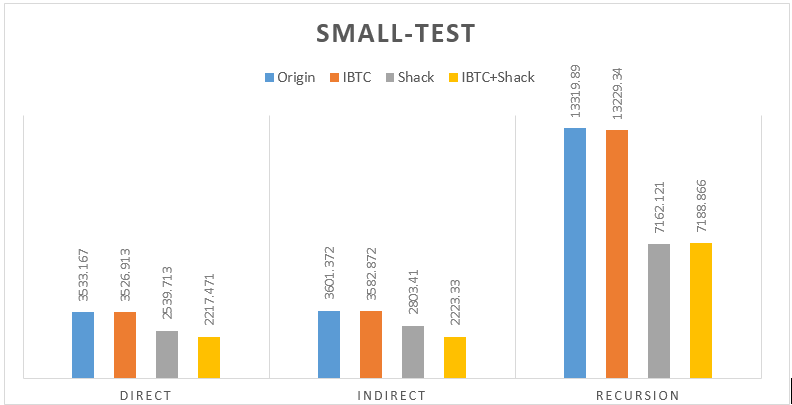
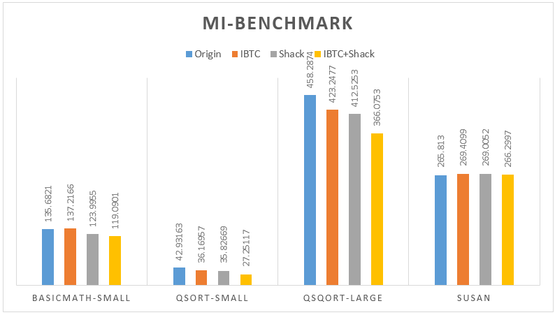
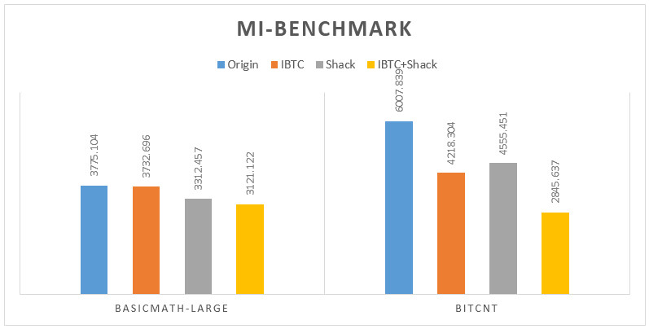
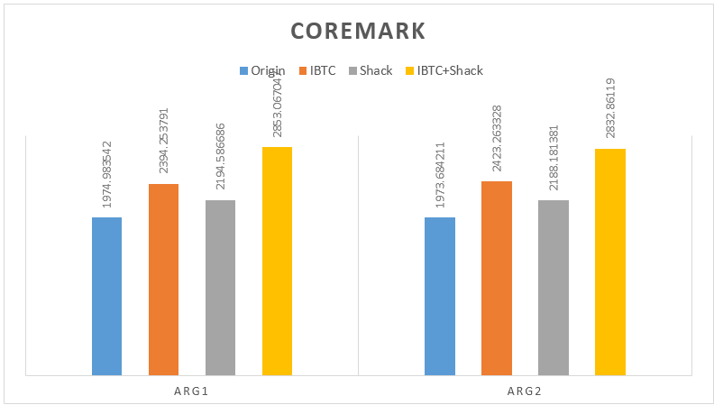

## 環境建置 ##

### 安裝 ###

```
$ make build
$ make extract-benchmark
```

### 編寫代碼 ###

```
$ vim source/xxxx.c
```

#### 編譯 ####

```
$ make rebuild
```

### 測試 ###

#### 小測資測試 ####

```
$ ./run-benchmark.sh
```

#### 提供的 Benchmark 測試 ####

```
$ ./run-mibench.sh
$ ./run-coremark.sh
```

#### 多次用測試腳本 ####

```
$ ./log.sh test/direct-br/basic.out 10000000
```

## 作業描述 ##

在原生的 QEMU 模擬器上，利用提示的 Shadow Stack 和 Indirect Branch Target Cache 方法，加速 QEMU 在 Translation Block 執行時的效能。

## 實驗環境 ##

1.	Intel (R) Core (TM) i5-3470 CPU @ 3.20GHz
2.	64-bit - Windows 7 上運行 VirtualBox
3.	VirtualBox 安裝 32-bit Ubuntu – Kernel 3.13.0-32-generic

## 原理介紹 ##

QEMU 屬於 Process VM，將運行到的 Binary 檔案從 Guest OS 轉換成 Host OS 指令，翻譯時按照 Basic Block 為最小單位進行轉換，轉換過程產生 Tiny Generate Code (TCG)，TCG 是一種 QEMU 使用的 IR，隨後再從 IR 轉換到 Host OS 指令。

Basic Block 根據 jump, branch 為拆分邊界拆分成好幾塊，每一塊將由 QEMU 會將翻好的 Machine Code 放至 Code Cache，當發生 jump, branch 時，QEMU 在每一塊最後一個指令要求回到模擬器上面查找要跳躍的所在位置，模擬時維護 Guest OS 的 Program Counter 將對應到 QEMU 翻好的 Code Cache 的某一塊起始位址。由於維護 Guest OS CPU 狀態，轉換回到模擬器時，勢必要花時間在 Context-Switch。若能在運行過程中不跳回模擬器，利用可存取的記憶體資訊得到要跳躍的目標位址，便可大幅度地提升效能。

## 實作細節 ##

### Shadow Stack ###

Shadow Stack (簡稱 Shack) 為在每一段 Basic Block 在跳回模擬器前，塞入一些指令檢查由 QEMU 創建的 Stack 上是否能提供目標位址。如果資訊夠充分，直接從 Stack 取得目標位址，如此一來就能省下跳回模擬器的 Context-Switch 消耗。由於大多數的 Basic Block 相當小，跳躍次數一多效能差距就會顯現。而 Stack 上儲存資訊為 Guest PC 對應 Host Physical Address，經過 QEMU 翻譯的流程，Guest PC 對應的 Physical Address 不見得馬上能使用，為了更有彈性一點，採用索引的方式檢查目標位址是否可使用。

不只是在執行時期取得目標位址的效能影響，同時也要考慮 Guest PC 對應的 Physical Address 會因為 Code Cache Manager 改變，因此需要效能好的資料結構完成映射工作，這裡採用 HASH 來完成。

在 `cpu-defs.h` 中，改掉原本的索引方式，不需要額外用一個陣列儲存所有的目標位址，那樣的寫法也許在 Debug 會比較容易，但在快取效果通常是不好的，因此直接寫在 HASH 產生的節點資訊中，因此只要在 Stack 上儲存 HASH 節點的實體位址，就能取得目標位址的數值為何。

```cpp
// in cpu-defs.h
void *shack;
void *shack_top;
void *shack_end;
struct shack_hash *shack_hash;
```

```
// in optimization.h
struct shack_slot 
{
	target_ulong guest_eip;	/* key */
	unsigned long *host_eip;			/* value */
	struct shack_slot *next;
};
typedef struct shack_slot shack_slot;

struct shack_hash
{
	shack_slot *head[SHACK_BUCKET];
};
```

撰寫 HASH 時，QEMU 呼叫 `shack_set_shadow()`，用簡單的 AND Mask 找到合適 Bucket 的插入，在 QEMU 中有提供計算量較多的 HASH 函數，在此不做考量。HASH 插入採用 __鏈式前向星__ 的實作技巧，只需要記錄下一個元素值為何，別於 Kernel 中常使用的雙向鏈表，實作的複雜度沒有必要多紀錄一個指針，省下記憶體空間有機會讓效能更好。

在 `void push_shack(CPUState, cpu_env, next_eip)` 中，要從 `CPUState` 取得 Shadow Stack Layout 並將其存放在 `cpu_env` 狀態中。在撰寫 TCG 時，特別小心暫存器的類型，分成 `tcg_temp_new` 和 `tcg_temp_local` 兩種，前者在執行 branch 後不保證數值還在，後者提供在跨越 branch 指令後數值仍保留。下附是一段虛擬碼，在執行 `call` 指令時，要將 return address 放入 Stack 中。

```cpp
tmp_shack_top = CPUState.shack_top
tmp_shack_end = CPUState.shack_end
IF1.BEGIN: tmp_shack_top == tmp_shack_end
	tmp_shack_top = CPUState.shack
	CPUState.shack_top = tmp_shack_top
IF1.END:
tmp_shack_top = CPUState.shack_top
tmp_shack_slot = shack_hash_find(cpu_env, next_eip)
tmp_shack_top += sizeof(void*);
shack[tmp_shack_top] = tmp_shack_slot
```

在 `void pop_shack(cpu_env, next_eip)` 中，特別小心傳入的參數可能會因為是 `tcg_temp_new` 而無法跨越 branch，透過 `tcg_temp_local` 將數值保存下來，在取得 HASH 上的節點時，特別小心要經過兩次 load address 完成，然而有可能 QEMU 還沒有將所需要的 Basic Block 翻譯好，在預設 NULL 的情況下，返回原先 QEMU 預設的判斷，回到模擬器上決定下一個 Basic Block 位址。下附是一段虛擬碼，在執行 `ret` 指令時，從 Shadow Stack 取得目標位址，有可能因為 Pop 次數多於 Stack 大小而失敗：

```cpp
tmp_shack_top = CPUState.shack_top
tmp_shack_begin = CPUState.shack
IF1.BEGIN tmp_shack_top != tmp_shack_begin
	tmp_shack_top -= sizeof(void*)
	tmp_shack_slot = *tmp_shack_top
	tmp_shack_eip = tmp_shack_slot.guest_eip
	IF2.BEGIN tmp_shack_eip == next_eip
		tmp_shack_eip = tmp_shack_slot.host_eip
		IF3.BEGIN tmp_shack_eip != NULL
			<set next jump>
		IF3.END
	IF2.END
IF1.END
```

### Indirect Branch Target Cache ###

Indirect Branch Target Cache (簡稱 IBTC) 採用 QEMU helper function 的方式完成，QEMU 會在編譯時期翻譯成 Host OS 相對應的 Machine Code，接著在運行時期會把這一段函數放置 Code Cache，提供正在運行的 Guest Process 可以特過 process call 運行這段程序。由於 Shadow Stack 提供的大小有限時，可以利用 IBTC 這一類的 Local Cache 完成剩下失敗的查找。

實作要完成 `void *helper_lookup_ibtc(guest_eip)` 和 `void update_ibtc_entry(*tb)`，呼叫 `helper_loopup_ibtc()` 查找 Cache 是否存放對應的目標位址。如果不存在，則利用 `__thread` 執行緒保護修飾的全區 Flag，讓 QEMU 決策是否要將上次運行失敗的位址存入。

### Debug ###

透過 `gdb` 協助找到 Core Dump 的位置，可用來解決資料結構運行時問題

```
$ gdb --args build.qemu/i386-linux-user/qemu-i386 test/recursion-fib/func_ptr 40
```

透過 `qemu` 提供的 debug option 印出 QEMU 翻出的 TCG，檢查撰寫的 inject code 對不對，用來解決誤用的 API。

```
$ ./build.qemu/i386-linux-user/qemu-i386 -d in_asm,op test/indirect-branch/func_ptr 1000
$ cat /tmp/qemu.log
```

## 效能測試 ##

在每一種測試分別運行 10 次取最小值，分別針對不同的優化策略得到以下結果：
1.	Small-Test 撰寫最一般的函數呼叫、函數指標呼叫以及遞迴函數呼叫。
2.	在 Mibench 測試中，用指令 perf stat 印出的 task-clock (msec) 訊息比較，數值越低越好，同時相當於執行時間。
3.	在 CoreMark 測試中，從測試工具中印出的 Iterations/Sec 訊息比較，數值越高越好。









## 結語 ##

在 Shadow Stack 在各種類型的程序下都有明顯加速，反之在 IBTC 的改善並不是在各種測試下都有明顯地加速，兩種優化策略可以同時運行以獲得更好的加速，在最好的情況下，實作結果達到兩倍快。而在 CoreMark 的測試下，也獲得 40% 的效能改善。

## 參考 ##

1.	檔案和測試腳本可以從 https://github.com/morris821028/hw-VirtualMachine 取得
2.	Mi-bench http://vhosts.eecs.umich.edu/mibench/
3.	CoreMark http://www.coremark.org/

